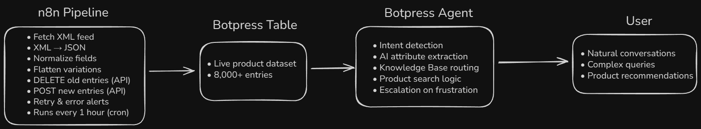
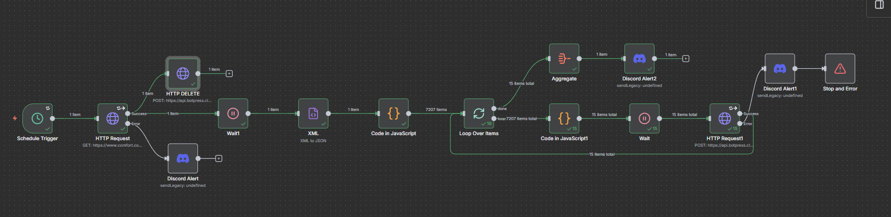
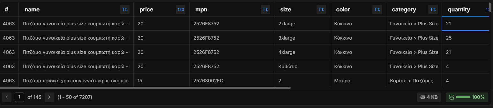

# AI Commerce Assistant  
Autonomous agent system for a REAL lingerie & homewear e-shop, built to operate 24/7 with live product data, semantic search, decision-making logic, and multi-KB reasoning.

This project demonstrates an end-to-end intelligent system:
- continuous product ingestion (8,000+ SKUs)  
- autonomous decision-making  
- product search & recommendation logic  
- multi-KB domain knowledge  
- error handling & monitoring  
- automated workflows through n8n  

It is designed as a real-world agent that thinks, decides, executes tasks and saves operational time.

---

## System Architecture

The assistant is built as an autonomous system combining:

- **Botpress (reasoning layer)**  
  Intent routing, attribute extraction, product search logic, multi-KB reasoning.

- **n8n (automation & orchestration layer)**  
  Hourly product ingestion, XML → JSON pipeline, retries, Discord alerts, and Botpress table updates.

- **Botpress Database (data layer)**  
  Live product dataset available directly to the agent for search and recommendations.

---

## 🚀 Core Capabilities

### **1. Autonomous Product Data Pipeline (8,000+ SKUs)**

An end-to-end pipeline that keeps the agent’s dataset up to date without human intervention:
- Hourly XML → JSON → Normalization  
- Automated field cleaning (category, size, color, gender, price)
- Flattens product variations so each becomes a standalone entry  
- Removes outdated records via DELETE API  
- Uploads new products in safe 500-item batches  
- Response validation, retry logic, and failure recovery  
- Real-time Discord alerts for errors or successful syncs  

---

### **2. Multi-Step Reasoning & Decision Flow (n8n + Botpress)**
The system coordinates reasoning (Botpress) with execution (n8n):
- Botpress extracts intent & structured attributes  
- n8n handles execution, transformations, and persistence  
- Autonomous loops ensure tasks complete even after failures  
- Agent routes tasks between KB lookup → attribute extraction → product search → execution workflows  

---

### **3. Intelligent Product Search Engine (Tool + AI Hybrid)**
A hybrid reasoning system combining AI understanding with rule-based filtering:
- AI decomposes user input (category, gender, price, size, color)  
- Custom filtering engine selects relevant SKUs  
- Semantic reasoning over product descriptions  
- Returns minimal, relevant results (carousel)  
- Handles complex multi-condition queries naturally  

---

### **4. Multi-Knowledge-Base Agent Brain**
The agent dynamically selects the correct knowledge source:
- **Default KB** → policies, delivery, returns  
- **Gifts KB** → recommendations by gender & budget   
- **Advice KB** → domain guidance (lingerie & homewear basics)

---

### **5. Orchestration, Monitoring & Recovery**
The system maintains its data consistency and handles:
- failure detection  
- automated retries  
- escalation to human support when frustration is detected  
- stable long-term autonomy with minimal maintenance  

---

## Botpress Agent Layer
Botpress is the conversational and interpretation layer of the system.  
It transforms free-text user messages into structured actions, selects the correct workflow, and collaborates with n8n to complete tasks end-to-end.

### **1. Intent Detection**
The agent identifies user intent with high accuracy:
- product search  
- store information & policies   
- gift suggestions  
- domain questions  
- frustration → human escalation  

---

### **2. AI Attribute Extraction**
Botpress converts natural language into structured attributes:
- category  
- gender  
- size  
- color  
- price range  
- product codes  
- style keywords  

These feed directly into the search engine.

---

### **3. Product Search Flow**

Botpress orchestrates the full logic:
- normalizes extracted attributes  
- triggers the custom product search tool  
- filters results from the live dataset  
- returns relevant SKUs in a clean carousel format  
- includes fallback behavior when data is incomplete  

---

### 📦 Live Product Dataset (Botpress Table)

---

### **4. Multi-Knowledge-Base Routing**
Dynamic selection between store policies, gifts, and advice knowledge bases for accurate answers.

---

### **5. Conversational Management**
- clarifying questions when needed  
- multi-turn context retention  
- guided product discovery  
- escalation when frustration is detected  

---

The full private bot and client-specific flows are intentionally excluded.
